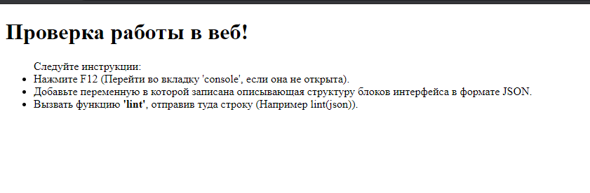
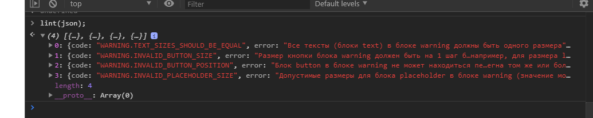

## УВАЖАЕМАЯ КОМАНДА ШКОЛЫ РАЗРАБОТКИ ИНТЕРФЕЙСОВ, ИЗВИНИТЕ!
**Я заранее хотел бы принести извинение за мою ошибку,  невнимательность к прочитанным условиям**
В ходе проверки всех условий и заданий, я обнаружил, что не так его выполнил. Я отправил просто 'build' с моим линтером, а в условиях требовалось показать: как я делал автотесты, какое у меня качество кода, быстродействие и так далее. **Поэтому было принято решение отправить не только папку с линтером, но и все мои наработки в ходе решения**.

## ДОБАВЛЕННЫЕ ИЗМЕНЕНИЯ
После того, как я сделал 3 задание и все отправил, у меня осталось чувство, что я что-то не успел сделать или не сделал. В связи с этим я начал перечитывать задания и перейдя ко второму из них обнаружил, что не так понял условия. В связи с этим было принято решение добавить всё необходимое для проверки задания:

Первое, что я не учел, это то, что проверять будет не только автотест на сайте, но и люди. У меня тут все настроено, свои автотесты, своя проверка веба, а о других не позаботился. В общем, я снова перенес все в свой проект, чтобы показать, как все работает.

1. Проверка, что все работает в браузере.
Для этого в папке **autotest**, я создал специальный файл **webtest.html**. Чтобы проверить, как все работает, просто запустите его и дальнейшие инструкции там уже расписаны.(см. пример ниже)

На следующем изображении можно увидеть, что все сработало.

2. Автотест с использованием **Jest**

Изначально я использовал свой простой автотест, но тут я наткнулся на видео о трендах разработки и узнал про 'Jest'. Решил попробовать его в деле, посмотреть, как он работает, так что не судите строго, если вдруг он не такой, как пишут всегда. Это скорее всего мой эксперимент, я понимаю, что рискую, но работает все хорошо и подсвечивает, так, как мне нужно. Мне понравилось и я продолжил работать с ним. Весь основной код автотеста находится в файле **auto.test.js**.  Чтобы запускать в нем код линтера, мной намеренно был создан файл **nodetest.js**, в котором экспортируется наша функция. Все это сделано для автотестов, само собой после успешного прохождения мы можем от них избавиться и оставить только наш линтер.

- Для запуска автотеста необходимо ввести в консоль: **npm test**

## ДОБАВЛЕНИЕ ESLINT
Одним из пунктов является оформление кода и аккуратность работы. Изначально я писал его сам, надеясь на свою аккуратность и свой опыт, почему-то подумал про **eslint**, когда начал делать 3 задание. Следовательно, нужно было добавить его и проверить свое написание кода. Теперь все красиво и аккуратно, я доволен и мне нравится. Надеюсь у вас остануться такие же эмоции.

## JSON_SOURCE_MAP
В проекте я использовал данный пакет (Название в заголовке!). Он вполне удовлетворяет моим запросам для разбора и структурирования строки в исходную карту для JSON указателей на все узлы. (Parse/stringify JSON and provide source-map for JSON-pointers to all nodes. - что можно прочитать в описании.). Обновляли пакет совсем недавно, в отличии от остальных альтернатив, и работает он так, как мне нужно. В целом, я поменял только маленькую часть всего файла, чтобы исполнение соответствовало нашему заданию. Код автора очень понятен, поэтому необходимости как-то его по мелочи переделывать я не увидел. Так-как не было запрещено использовать сторонние инструменты и библиотеки, отказываться от такой возможности я не стал.
В целом я больше не использовал сторонних библиотек и писал все на чистом js. 

## МАТЕРИАЛЫ И ПОЧЕМУ ТАК
Изначально было очень интересно понять, как написать свой парсер. Понял, что это будет долговато и времени нет, поэтому решил использовать готовый вариант. 
Так-как пожелание со стороны задания были - "Записать все в одном файле, и чтобы все могло работать прямо из браузера" - я оставляю только собранный файл в папке build. Также стояла задача пройти по всему дереву JSON, и изначально я нашел библиотеку (https://www.npmjs.com/package/traverse), которая в целом работает, но это опять внешние зависимости. Можно было бы тоже перенеести эту часть когда к себе в проект, но от этого его бы стало намного больше. Мне помог stack overflow, и подсказал решить эту проблему очевидным путем. Рекурсией (https://stackoverflow.com/questions/722668/traverse-all-the-nodes-of-a-json-object-tree-with-javascript). Также я видел решение с использованием jquery, но мне принципиально хотельсь писать на чистом js. Я очень редко прибегаю к помощи jquery и если есть возможность понять, как написать то, что реализовано там, я это делаю. Понимаю, что это решение не самое лучшее и занимает память, но этот способ мне показался легче. В целом мне еще многому стоит научиться, особенно в алгоритмах.

## ОТЗЫВ
Очень интересное задание, пошевелить извилинами)  
Что мне помогло?
1. Stack Overflow
2. Спасибо уже написанным пакетам и библиотекам, которые можно подсмотреть и на которые можно равняться
3. Спасибо купленному мной курсу на Udemy по алгоритмам на JS. Просмотры и пробы что-то поменяли в моей голове. Пока не знаю что.
4. Мое терпение - очень много сайтов пришлось перечитать, перебрать их варианты, вставлять и проверять методами проб и ошибок. 